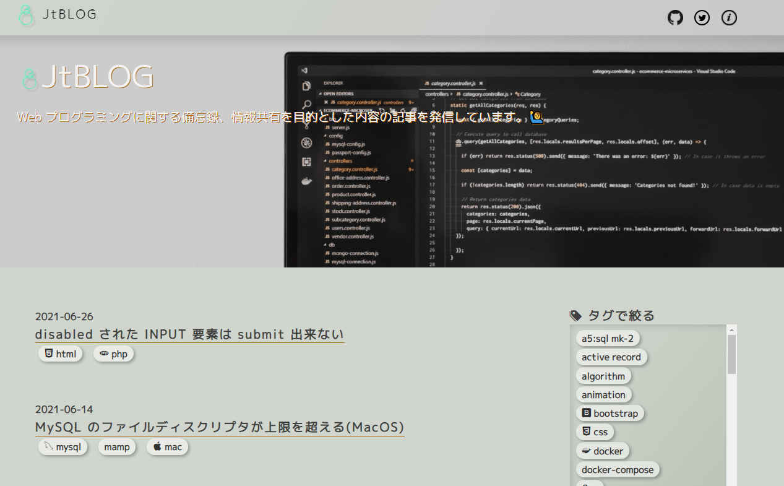
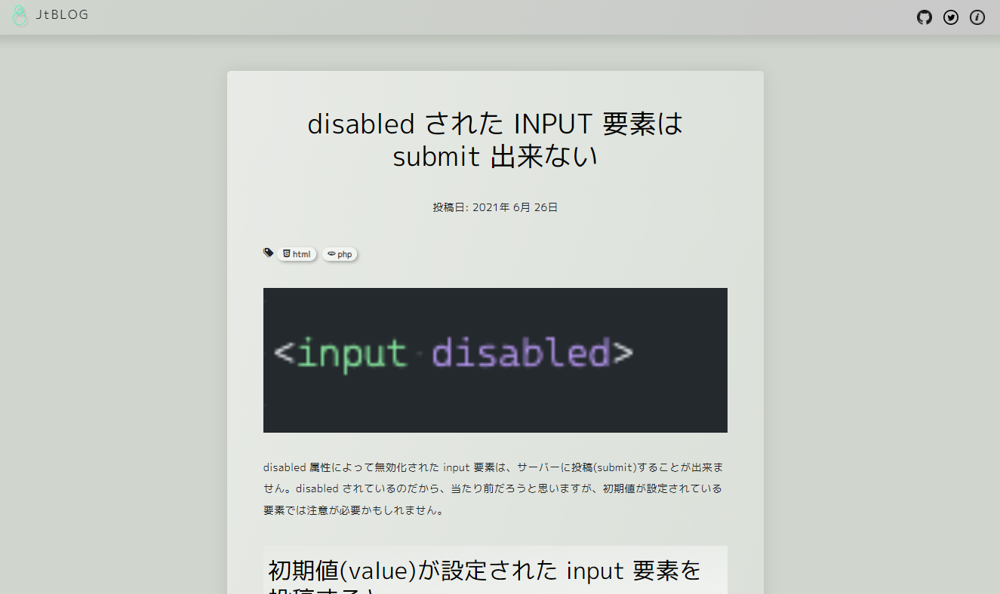
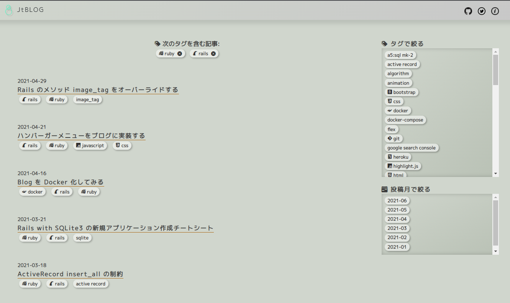
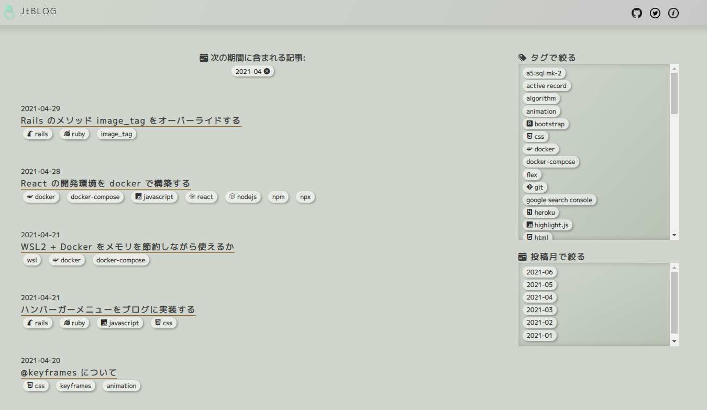
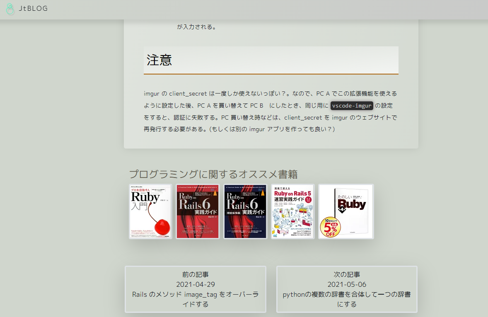
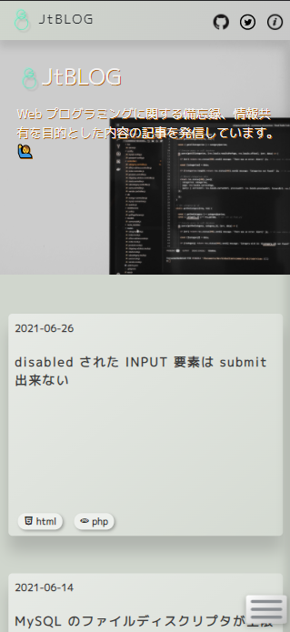
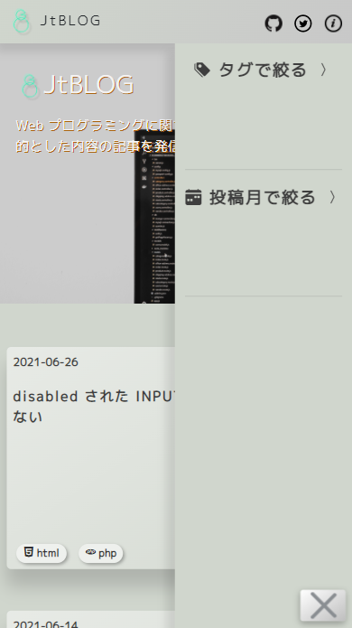

# Blog の README.md










## ブログの URL

https://junya-takaesu.site/

## 開発の始め方
### Docker を使う
```
docker-compose up -d
```

## rails コマンド(rake コマンド)

### 新しいブログのエントリーを追加する

```
rails blog:new
docker exec -it portfolio_blog_rails_web_1 rails blog:new
```
* コマンド実行の前に:
  * docker-compose の web サービス から git push するため、ssh の鍵ファイルが必要
  * .ssh ディレクトリを web サービスにマウントすることで、web サービスから git 操作を行えるようにする
  * .ssh ディレクトリを web サービスにマウントするために、.ssh ディレクトリのパスを、`.env` ファイルに `SSH_DIR_PATH` という名前の変数で定義する
    * `SSH_DIR_PATH` に代入するパスの末尾にスラッシュは不要
  * `SSH_DIR_PATH` を使って docker-compose.yml が マウントする

* このコマンドにより `lib/tasks/blog.rake` の `task :new`　が実行される
* `app/views/articles` ディレクトリに、空の Markdown ファイルが作成され、ブログを書き始められる。
* `app/views/articles/articles.json` に、ブログ記事のメタ情報が記録される（作成日,タグなど）

### 作成したブログをコミットする(WIP)

```
rails blog:submit
```

* このコマンドにより `lib/tasks/blog.rake` の `task :submit`　が実行される
* git にコミットするかどうかプロンプトされる
* コミットを承諾すると、git にコミットされ、github リポジトリの所定のブランチに push される
* github 上で、所定のブランチに push されたコミットを main ブランチにマージすると、連動して heroku にデプロイされる。（記事が一般に公開される）
